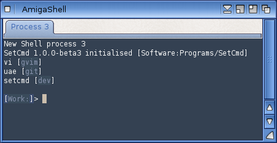

# SetCmd

SetCmd is a utility for the AmigaOS 4.x shell that lets you quickly and easily switch between different versions of installed software.


# Background

I developed SetCmd primarily to solve a problem I had - switching between different versions of the UAE Emulator on my [X5000](https://www.markround.com/blog/2018/10/10/new-amiga-x5000/) while using [classic Amiga software](http://www.markround.com/blog/2018/10/30/classic-amiga-emulation-on-the-x5000/). It was also written to accompany my series of [blog posts](http://www.markround.com/blog/categories/amiga/) exploring the next-gen AmigaOS, written from the perspective of an old ex-Amigan returning to the scene. I used it as an experiment to learn how to develop, package and distribute software for AmigaOS, as well as picking up the C language along the way. Excluding variations on "Hello, World!" I studied years ago at University, this tool is my first full C program ever, and my first release for the Amiga in a very long time! 

I wanted to make the tool as Amiga-native as possible. This meant things like:

 * Providing an [Installer](http://aminet.net/package/util/misc/Installer-43_3) script to [install the software](Install_SetCmd)
 * [Documentation](SetCmd.guide) in [AmigaGuide](*https://en.wikipedia.org/wiki/AmigaGuide) format 
 * Using [AmigaOS 4.x SDK](https://wiki.amigaos.net/wiki/Autodocs:Main) functions and standards instead of "portable" C (options parsing via `IDOS->ReadArgs` instead of just pulling things out of `argc`, shell output through `IDOS->Printf` instead of `printf` in the C standard library, etc.)

So if there are any hardcore Amiga developers out there reading this, bear in mind this is my first attempt at all of this! That said, I'd love any feedback, pull requests, comments etc. that will help my learning and understanding of all these different technologies.

# Quickstart

After you have run the installer, create a `SETCMD:` assign pointing to the installation directory, and run `setcmd init` from there:

```
assign SETCMD: Software:Programs/SetCmd
SETCMD:setcmd init
```

This installs SetCmd so it's directory of managed commands comes first in your shell search path.

Then you can add a command, and add versions for that command. Here's a quick example using the UAE emulator as the command to be managed:

```
setcmd add-cmd uae
setcmd add-version uae system System:Emulation/E-UAE-amigfx/uae
setcmd add-version uae dev Work:Downloads/E-UAE-git/uae
```

And switch between them:

```
setcmd set-version uae system

; uae command now points to the system-provided UAE emulator

setcmd set-version uae dev

; uae command now points to the git checkout in my Downloads directory
```

## Automatic initialisation
If you'd like SetCmd to always be available, you can add the following lines to your `S:Shell-Startup`:

```
; BEGIN SetCmd
assign SETCMD: Software:Programs/SetCmd
SETCMD:setcmd init verbose
; END SetCmd
```

Just make sure you point the `SETCMD:` assign at the directory where SetCmd is installed.

This will make sure SetCmd is intialised on each new shell session, and will also display some verbose output showing what commands are available:




You can change this to just `setcmd init` if you want to reduce the output, or `setcmd init quiet` for no output at all.

Alternatively, if you'd like it to be available system-wide and not just when you start a shell session, you could add the same lines to `S:User-Startup`. You'll probably want to use `setcmd init quiet` there, though.

## Fomatting
If you would prefer SetCmd output displayed without formatting (no bold text, highlighting etc.) then you can set the local environment variable `SETCMD_NOFORMAT`. For example:

```
set SETCMD_NOFORMAT true
``

# Documentation and Links
Running `setcmd` with no arguments displays the the usage screen shown at the top of this document, this provides quick examples for each function.

There is also a full [manual](SetCmd.guide) provided in AmigaGuide format that is installed along with the tool, along with an extended [README.txt](README.txt).

To read about the background of the development of this tool (and for my adventures with the Amiga in general), browse my Blog archives: [markround.com/amiga/](http://www.markround.com/amiga/).

# Requirements

 * AmigaOS 4.1 (4.0 _may_ work, but I haven't yet checked all the DOS calls to ensure they are compatible with earlier versions).
 * To build the source yourself, you will need the [latest version](https://www.hyperion-entertainment.com/index.php/downloads?view=details&file=82) of the AmigaOS 4.1 SDK installed.
 * I will attempt to port this to classic 68k AmigaOS 3.x, AROS, MorphOS and other Amiga-like systems in the future.

# Development

All the code lives under the [src](src) directory. There is a [Makefile](src/Makefile) provided; as long as you have the most recent version of the SDK installed, just running `make all` in this directory should provide you with the `setcmd` and `stub` binaries. You can also try running `make debug` to build debug versions with a lot more verbose output enabled.

Each sub-command (e.g. `init`, `add-command`, `set-version` etc.) is defined in it's own source file; for example the initialisation code is defined in [src/init.c](src/init.c). There is also a [utility.c](src/utility.c) which contains common shared functions, and it's header ([src/include/utility.h](src/include/utility.h)) also contains commonly used #defines, constants, retun codes and so on.

# Misc

As I hadn't learned enough C or figured out how to develop on the Amiga when I started this project, my first iteration of this tool was a proof-of-concept written as an AmigaDOS script. It may prove a useful reference to others, so I included it at [misc/dos_reference/setcmd/](misc/dos_reference/setcmd). It also used a ARexx script to generate the necessary PATH statements as I couldn't find a way to do this with basic AmigaDOS commands; this is at [misc/dos_reference/support/path.rx](misc/dos_reference/support/path.rx). 